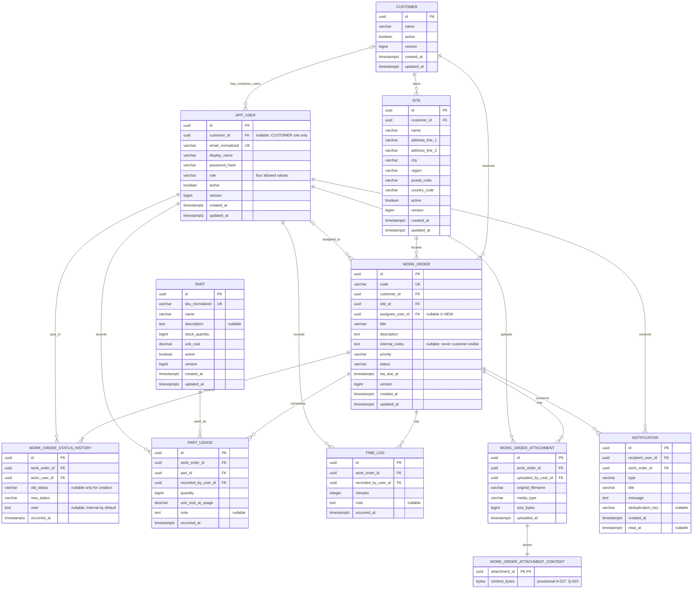

# Project KEYSTONE Entity Relationship Model

**Status:** Planning model; no JPA entities or Flyway migrations are generated here
**Database:** PostgreSQL, managed only by Flyway

## 1. Modeling Boundary

This ERD covers the required persistent domain: customers, sites, four-role users, work orders, status history, parts/usages, time logs, proof attachments, and in-app notifications.

- Explicit domain relationships and supplied locked choices are modeled directly.
- UUIDs, audit/version columns, and normalized keys are implementation assumptions. The illustrated attachment metadata/content split and PostgreSQL `bytea` content table are the provisional A-027 design, not accepted architecture; Q-023 must approve or replace them before migration work.
- Fields whose exact business dictionary is unresolved are a minimum planning shape, not a signed-off migration.
- SLA condition is derived from persisted work-order data and policy; it is not duplicated as an authoritative mutable entity.

## 2. Mermaid ERD



## 3. Enumerated Values

These are stored as constrained strings so database values remain readable and Flyway controls additions.

| Field | Allowed values |
|---|---|
| `APP_USER.role` | `DISPATCHER`, `TECHNICIAN`, `MANAGER`, `CUSTOMER` |
| `WORK_ORDER.status` | `NEW`, `ASSIGNED`, `IN_PROGRESS`, `ON_HOLD`, `COMPLETED`, `CLOSED`, `CANCELLED` |
| `WORK_ORDER.priority` | `CRITICAL`, `HIGH`, `MEDIUM`, `LOW` |
| Derived SLA status | Proposed A-032 values `ON_TRACK`, `AT_RISK`, `BREACHED`, `MET`, `NOT_APPLICABLE` once Q-002/Q-003/Q-012/Q-022 are approved |
| `NOTIFICATION.type` | At minimum assignment/reassignment, SLA at-risk, and SLA breached types; any additional type requires an approved trigger/recipient policy |

JPA must persist enum names as strings, never ordinals. Adding/removing a value requires a reviewed migration/compatibility decision.

## 4. Relationship Cardinality and Ownership

| Relationship | Rule |
|---|---|
| Customer -> Site | Every site belongs to exactly one customer; a customer may have zero or more sites. |
| Customer -> User | A customer-role user belongs to exactly one customer. Internal users have no customer association. |
| Customer/Site -> WorkOrder | Every work order belongs to exactly one customer and one site; that site must belong to the same customer. |
| User -> WorkOrder assignee | A work order is unassigned only in permitted states. One technician may be assigned many work orders. |
| WorkOrder -> StatusHistory | Every work order has at least the initial creation event and then one row per successful transition. |
| WorkOrder/Part/User -> PartUsage | Usage identifies one order, one part, and the recording actor and snapshots cost. |
| WorkOrder/User -> TimeLog | A time log identifies one order and recording actor. |
| WorkOrder/User -> Attachment | Metadata identifies one order and uploader. The illustrated one-content-row relationship applies only if provisional PostgreSQL design A-027 is approved under Q-023. |
| User/WorkOrder -> Notification | Every required notification has one recipient and concerns exactly one work order. |

## 5. Required Database Constraints

### 5.1 Customer, site, user, and work-order coherence

- Primary keys are non-null UUIDs.
- `SITE.customer_id`, `WORK_ORDER.customer_id`, and `WORK_ORDER.site_id` are non-null foreign keys.
- Add `UNIQUE (id, customer_id)` on `SITE`, then a composite foreign key from `WORK_ORDER (site_id, customer_id)` to `SITE (id, customer_id)`. This makes a cross-customer site/work-order pair impossible even if service validation is bypassed.
- `APP_USER.email_normalized` is trimmed/lowercase and unique. A database check or generated normalization approach must agree with application normalization.
- Enforce the same-row user-role/customer invariant:

  ```text
  role = CUSTOMER  => customer_id IS NOT NULL
  role != CUSTOMER => customer_id IS NULL
  ```

- `WORK_ORDER.code` is non-null and unique; clients never set it.
- Work-order `status` and `priority` use allowlist checks/enums.
- `WORK_ORDER.version` starts at a defined non-negative value and changes on aggregate mutation.
- `sla_due_at` is non-null once Q-001/Q-002/Q-022 permit deterministic creation. It stores the calculated commitment so later configuration changes do not rewrite existing orders.

### 5.2 Status and assignee coherence

Use a same-row work-order check where practical:

```text
status = NEW => assignee_user_id IS NULL
status IN (ASSIGNED, IN_PROGRESS, ON_HOLD, COMPLETED, CLOSED)
    => assignee_user_id IS NOT NULL
status = CANCELLED => assignee_user_id may be null or non-null
```

The database foreign key proves only that the assignee user exists. The service must additionally prove that the target is active and has role `TECHNICIAN`; a normal CHECK constraint cannot inspect another table safely.

No generic repository/controller may update status or assignee outside the state/assignment service.

### 5.3 Append-only status history

- `work_order_id`, `actor_user_id`, `new_status`, and `occurred_at` are non-null.
- `old_status` is null only for the creation row; that row's `new_status` must be `NEW`.
- Non-creation history requires `old_status IS NOT NULL` and `old_status <> new_status`.
- A partial unique index permits at most one creation row per work order:

  ```text
  UNIQUE (work_order_id) WHERE old_status IS NULL
  ```

- No API/repository update or delete operation exists for history. Foreign keys and deactivation preserve actor/work-order references; unsafe cascade delete is prohibited.
- Application/database permissions may further deny UPDATE/DELETE to the runtime principal, but the migration strategy for that defense must be chosen explicitly.
- The database cannot cheaply prove the whole adjacent-state chain; the state service and exhaustive tests prove legal ordering and exactly one row per successful transition.

### 5.4 Inventory and time integrity

- `PART.sku_normalized` is unique under the approved normalization rule.
- `PART.stock_quantity >= 0` and `PART.unit_cost >= 0`.
- `PART_USAGE.quantity > 0` and `PART_USAGE.unit_cost_at_usage >= 0`.
- `TIME_LOG.minutes > 0`.
- Stock check/decrement and usage insert share one transaction and a row lock/atomic update. The database non-negative check is the last line of defense, not the concurrency algorithm.
- `unit_cost_at_usage` is immutable historical data; changing `PART.unit_cost` never changes past usage.
- Derived work-order labour/part totals should be aggregate queries or carefully maintained values; this baseline does not duplicate authoritative totals in `WORK_ORDER`.

### 5.5 Attachments

This subsection describes the provisional A-027 PostgreSQL design shown in Mermaid. It is not a locked decision and must not become a Flyway migration until Q-023 is approved.

- `WORK_ORDER_ATTACHMENT.size_bytes > 0`.
- `original_filename`, validated `media_type`, uploader, work order, and upload time are non-null.
- `WORK_ORDER_ATTACHMENT_CONTENT.attachment_id` is both primary key and foreign key, enforcing at most one content row per metadata row. The service transaction enforces exactly one.
- Metadata insert and bytes insert commit or roll back together.
- The database does not decide MIME/signature safety. The service validates configured size, declared type, content signature, filename, and approved image/decompression limits before persistence.
- No filesystem path, base64 work-order field, or attachment bytes appear in metadata/list DTOs.

### 5.6 Notifications and idempotency

- Recipient, work order, type, title/message or approved structured display data, and `created_at` are required.
- `read_at IS NULL` means unread; otherwise it is read. A redundant mutable boolean is not required.
- Use a service-defined `deduplication_key` for events requiring idempotency. A partial unique index such as `UNIQUE (recipient_user_id, deduplication_key) WHERE deduplication_key IS NOT NULL` prevents repeated scheduler delivery for the same approved event/recipient.
- The key format must account for event kind and approved reopen semantics without embedding customer-sensitive text.
- Notification ownership never substitutes for current authorization on the referenced work order.

## 6. Index Plan

Final names belong in Flyway, but the first schema should support these access patterns:

| Table | Index purpose |
|---|---|
| `app_user` | unique normalized email; role/active technician selector; customer users by customer |
| `site` | customer/active/name lists; unique `(id, customer_id)` support |
| `work_order` | unique code; customer/status; site/status; assignee/status; priority; `sla_due_at` for bounded open-SLA scans; created/updated list ordering |
| `work_order_status_history` | `(work_order_id, occurred_at, id)` chronological history |
| `part` | unique normalized SKU; active/name catalogue |
| `part_usage` | work order/time; part/time; recording user/time |
| `time_log` | work order/time; recording user/time |
| `work_order_attachment` | work order/upload time; uploader/time |
| `notification` | recipient/read-at/created-at inbox; recipient/type; partial idempotency key |

Every pageable query still includes a deterministic ID tie-breaker. Indexes should be confirmed with representative PostgreSQL query plans rather than added speculatively without use.

## 7. Foreign-Key and Deletion Policy

- Default to `ON DELETE RESTRICT`/`NO ACTION` for customer, site, user, work order, part, history, usage, time, attachment, and notification relationships.
- Master data with historical references is deactivated rather than hard deleted.
- No broad JPA cascade from customer/site/work order may delete audit or operational children.
- If A-027 is approved, the metadata/content one-to-one may use a tightly scoped cascade only if an approved attachment-deletion policy is later introduced; no deletion route exists now.
- Demo/test teardown is infrastructure code and does not define production cascade behavior.

## 8. Audit Timestamps and Versions

- `created_at` is server controlled and immutable.
- `updated_at` is server controlled on mutable aggregate/master records.
- Event records (`status_history`, `part_usage`, `time_log`, `attachment`, `notification`) use immutable occurrence/creation timestamps and do not need `updated_at` except notification `read_at`.
- The lifecycle service uses an injected controllable clock; production values are stored as UTC instants.
- Optimistic versions are required for work orders and planned for mutable user/customer/site/part records. API/ERD/OpenAPI must agree on initial value and update semantics before implementation.

## 9. Transaction Boundaries

These operations are single PostgreSQL transactions:

1. Work-order insert plus generated code/due/version plus `null -> NEW` history.
2. First assignment: status, assignee, version, `NEW -> ASSIGNED` history, incoming-technician notification.
3. Reassignment: assignee, version, incoming-technician notification; no status-history row.
4. Status command: status, version, exactly one history row, and approved synchronous side effects.
5. Part usage: actor/state validation, part lock/atomic stock decrement, cost snapshot, usage insert, and any derived aggregate update.
6. If A-027 is approved, attachment upload: validated metadata and PostgreSQL bytes. Another Q-023 storage decision requires its own documented consistency/cleanup behavior.
7. First-entry SLA notification/deduplication record creation.

Any failure rolls back the complete operation. Concurrency tests must use PostgreSQL, not an in-memory substitute.

## 10. Flyway and JPA Rules

- Flyway creates every table, enum/check, foreign key, unique/partial index, ordinary index, seed record, and optional permission.
- Hibernate is configured with `spring.jpa.hibernate.ddl-auto=validate` in shared/runtime profiles.
- Once a migration is shared or deployed, never edit it to change checksums; add a new migration.
- Fresh-database migrate, Flyway validate, Hibernate validate, restart/idempotent seed behavior, and prior-version upgrade are required tests.
- Relationships are lazy by default. Avoid bidirectional collections unless a proven use case needs them, and never expose entities through controllers.
- DTO mapping, scoped repository queries, service authorization, and database constraints provide independent layers; no one layer replaces another.

## 11. Constraints Not Fully Expressible in Mermaid or Simple SQL

The service/domain layer must enforce:

- active technician role for assignment;
- the exact 7-by-7 state matrix and actor/ownership rules;
- one history row in the same transaction as each accepted transition;
- customer principal/site ownership and customer-safe field views;
- technician assignment scope on reads and nested commands;
- non-terminal eligibility for editing, parts, time, and attachments once Q-006/Q-010 are approved;
- completed-work reassignment denial until Q-007;
- same-technician assignment behavior after Q-021;
- notification recipient and dedup semantics after Q-008 and the SLA-policy questions in `ASSUMPTIONS.md`;
- attachment signature/content safety and visibility; and
- SLA calendar/status/compliance rules.

## 12. Open Data-Model Questions

1. Final required/optional fields, lengths, address/contact structure, and currency (Q-011).
2. Customer-selected/default priority, approved SLA durations/warning window, and deterministic SLA calendar are needed before making `sla_due_at` non-null in the first shared schema (Q-001/Q-022/Q-002).
3. Status windows for ordinary edits, part/time/proof capture, and whether time may be backdated (Q-006/Q-010).
4. Completed/same-technician reassignment and whether a separate assignment-audit entity is required (Q-007/Q-021). No fake status-history row is allowed.
5. User role/customer reassociation, initial credential delivery, active assignment behavior, and self-deactivation (Q-009/Q-014).
6. Attachment content storage, types/limits, customer/dispatcher visibility, retention, and deletion/replacement policy (Q-005/Q-017/Q-019/Q-023/Q-024).
7. SLA threshold equality, hold/reopen/completion semantics, notification recipients, scheduler service level, compliance denominator, and whether any immutable SLA outcome timestamp/field must be persisted (Q-003/Q-008/Q-012/Q-015).
8. Notification retention/read reversal, inbox refresh/pagination semantics, and whether additional event types require new uniqueness semantics (Q-017/Q-025).

Resolve these before the affected migration/API behavior is implemented. Do not add columns/entities for speculative features.
