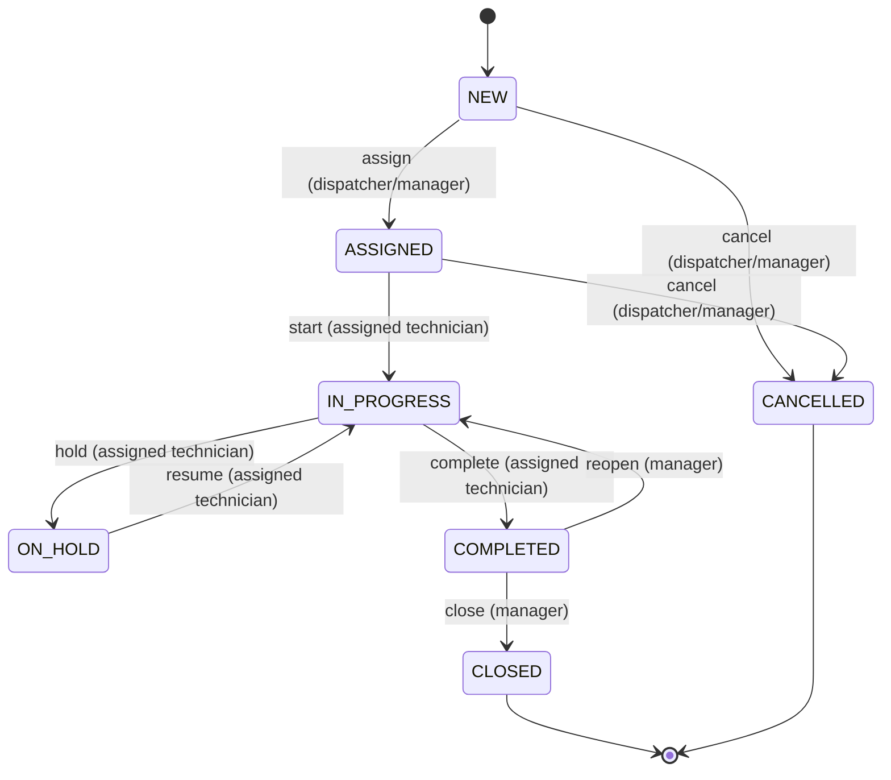

# Project KEYSTONE work-order state machine

## Purpose and authority

This document is the single lifecycle contract for work orders. Controllers, UI controls, imports, tests, and administrative actions must all use the same domain service; none may update the status column directly.

The state-pair matrix below is exhaustive. If a transition is not listed as allowed, it does not exist. In particular, a manager is not a universal lifecycle override.

## Explicit brief requirements

The supplied brief defines exactly seven statuses and these transitions:

- `NEW -> ASSIGNED`
- `NEW -> CANCELLED`
- `ASSIGNED -> IN_PROGRESS`
- `ASSIGNED -> CANCELLED`
- `IN_PROGRESS -> ON_HOLD`
- `ON_HOLD -> IN_PROGRESS`
- `IN_PROGRESS -> COMPLETED`
- `COMPLETED -> IN_PROGRESS` for a manager reopen
- `COMPLETED -> CLOSED`
- `CLOSED` and `CANCELLED` are terminal.

The role behavior explicitly requires:

- Dispatcher: assign/reassign and dispatch work.
- Assigned technician: start, hold, resume, and complete assigned work.
- Manager: dispatcher capabilities plus close and reopen.
- Customer: no lifecycle command; read-only status/history for its organisation.

Every successful status transition has append-only audit history. Illegal transitions return HTTP `409 Conflict` and do not partially change the order or its side effects.

## Recorded implementation policies and assumptions

The supplied build playbook further records these implementation policies:

- Dispatcher or manager performs first assignment and may cancel `NEW` or `ASSIGNED` work.
- Only the assigned technician starts, holds, resumes, or completes a work order.
- Only a manager reopens `COMPLETED` work or closes it.
- Initial creation writes `null -> NEW` history.
- First assignment uses the assignment command, not the generic status command.
- Reassignment is allowed while eligible open work is assigned and preserves its current status. `COMPLETED` eligibility is unresolved and denied by default until approved.
- State mutation, history insertion, and defined side effects run in one transaction.
- Concurrent writes use explicit optimistic versioning and return a stable conflict rather than silently overwriting one another. Optimistic versioning is a planning decision; no JPA code is generated here.

Additional model invariants assumed by this specification are:

- `NEW` is unassigned.
- `ASSIGNED`, `IN_PROGRESS`, `ON_HOLD`, `COMPLETED`, and `CLOSED` retain a non-null technician assignee.
- `CANCELLED` preserves whatever assignee existed: it is null when cancelled from `NEW` and non-null when cancelled from `ASSIGNED`.
- `COMPLETED` is still non-terminal until manager close or reopen and remains on the open-work board. Board membership alone does not settle completed-work reassignment.
- There is no unassign-to-`NEW` operation and no route may simulate one by general work-order editing.

These invariants require confirmation as part of the unresolved questions at the end, but they do not introduce any additional lifecycle arrow.

## Status definitions

| Status | Meaning | Assignee invariant | Lifecycle mutability |
|---|---|---|---|
| `NEW` | Request recorded; no technician assigned. | Null | May be first-assigned or cancelled. |
| `ASSIGNED` | Active technician has been assigned but has not started. | Non-null | Assigned technician may start; dispatcher/manager may cancel or reassign. |
| `IN_PROGRESS` | Assigned technician is actively working. | Non-null | Assigned technician may hold or complete; dispatcher/manager may reassign without changing status. |
| `ON_HOLD` | Work has been paused. | Non-null | Assigned technician may resume; dispatcher/manager may reassign without changing status. |
| `COMPLETED` | Technician has declared field work complete; managerial disposition remains. | Non-null | Manager may reopen or close. Reassignment is denied until the open policy question is approved. |
| `CLOSED` | Manager accepted/finalized completed work. | Preserved | Terminal; read/history/download operations only. |
| `CANCELLED` | Work was cancelled before it began. | Preserved | Terminal; read/history/download operations only. |

For lifecycle purposes in this plan, **non-terminal/open** means `NEW`, `ASSIGNED`, `IN_PROGRESS`, `ON_HOLD`, or `COMPLETED`. **Terminal** means exactly `CLOSED` or `CANCELLED`.

## Canonical lifecycle diagram

The diagram is explanatory. The 7-by-7 matrix is the exhaustive normative representation.

## Exact 7-by-7 state-pair matrix

Rows are the persisted current/source status and columns are the requested target status. All 49 ordered pairs appear exactly once.

Legend:

- `A1`-`A9`: allowed only through the command and actor rule in the next table.
- `X`: illegal pair; return `409 ILLEGAL_WORK_ORDER_TRANSITION` after authentication, visibility, and applicable actor checks.
- `T`: terminal source; return `409 TERMINAL_WORK_ORDER_STATE` for every mutation attempt, including a same-state request.

| Current \ Target | `NEW` | `ASSIGNED` | `IN_PROGRESS` | `ON_HOLD` | `COMPLETED` | `CLOSED` | `CANCELLED` |
|---|---:|---:|---:|---:|---:|---:|---:|
| `NEW` | `X` | `A1` | `X` | `X` | `X` | `X` | `A2` |
| `ASSIGNED` | `X` | `X` | `A3` | `X` | `X` | `X` | `A4` |
| `IN_PROGRESS` | `X` | `X` | `X` | `A5` | `A6` | `X` | `X` |
| `ON_HOLD` | `X` | `X` | `A7` | `X` | `X` | `X` | `X` |
| `COMPLETED` | `X` | `X` | `A8` | `X` | `X` | `A9` | `X` |
| `CLOSED` | `T` | `T` | `T` | `T` | `T` | `T` | `T` |
| `CANCELLED` | `T` | `T` | `T` | `T` | `T` | `T` | `T` |

The `A1`-`A9` identifiers are labels, not extra statuses or API values.

## Allowed command and actor table

| Id | Command | Exact transition | Required actor | Route | Additional conditions |
|---|---|---|---|---|---|
| `A1` | First assign | `NEW -> ASSIGNED` | `DISPATCHER` or `MANAGER` | `POST /api/v1/work-orders/{workOrderId}/assign` | Body identifies an active `TECHNICIAN`; current assignee is null. Status, assignee, one history row, version, and assignment notification commit atomically. |
| `A2` | Cancel new | `NEW -> CANCELLED` | `DISPATCHER` or `MANAGER` | `POST /api/v1/work-orders/{workOrderId}/status` | `targetStatus=CANCELLED`; assignee remains null. |
| `A3` | Start | `ASSIGNED -> IN_PROGRESS` | The currently assigned `TECHNICIAN` | `POST /api/v1/work-orders/{workOrderId}/status` | `targetStatus=IN_PROGRESS`; a different or formerly assigned technician has no resource visibility. |
| `A4` | Cancel assigned | `ASSIGNED -> CANCELLED` | `DISPATCHER` or `MANAGER` | `POST /api/v1/work-orders/{workOrderId}/status` | `targetStatus=CANCELLED`; preserve the assignee for history. |
| `A5` | Hold | `IN_PROGRESS -> ON_HOLD` | The currently assigned `TECHNICIAN` | `POST /api/v1/work-orders/{workOrderId}/status` | `targetStatus=ON_HOLD`. |
| `A6` | Complete | `IN_PROGRESS -> COMPLETED` | The currently assigned `TECHNICIAN` | `POST /api/v1/work-orders/{workOrderId}/status` | `targetStatus=COMPLETED`. Completion does not close the order. |
| `A7` | Resume | `ON_HOLD -> IN_PROGRESS` | The currently assigned `TECHNICIAN` | `POST /api/v1/work-orders/{workOrderId}/status` | `targetStatus=IN_PROGRESS`. |
| `A8` | Reopen | `COMPLETED -> IN_PROGRESS` | `MANAGER` only | `POST /api/v1/work-orders/{workOrderId}/status` | `targetStatus=IN_PROGRESS`; existing assignee is preserved. |
| `A9` | Close | `COMPLETED -> CLOSED` | `MANAGER` only | `POST /api/v1/work-orders/{workOrderId}/status` | `targetStatus=CLOSED`; the resulting order is terminal. |

`CUSTOMER` has no assignment or status command. `DISPATCHER` does not gain start/hold/resume/complete/reopen/close. `MANAGER` does not gain start/hold/resume/complete merely through broader read access. A valid state pair attempted by a visible but ineligible actor returns `403 ACCESS_DENIED`, not `409` and not `401`.

## Assignment is not a generic status edit

### First assignment

`POST /api/v1/work-orders/{workOrderId}/assign` accepts a technician identifier and optional note. For a `NEW` work order it is the only command that may produce `NEW -> ASSIGNED` because assignment and status must change together.

- The target user must exist, be active, and have role `TECHNICIAN`.
- The transition sets the assignee and status, increments the work-order version, appends exactly one `NEW -> ASSIGNED` history record, and creates the defined in-app assignment notification in one transaction.
- `POST /api/v1/work-orders/{workOrderId}/status` with `targetStatus=ASSIGNED` must not assign. Even from `NEW`, it returns `409 ILLEGAL_WORK_ORDER_TRANSITION`; conflict `parameters` state that the assignment command is required.
- General `PUT /api/v1/work-orders/{workOrderId}` cannot write either status or assignee.

### Reassignment

The same `/assign` route performs reassignment when a non-terminal order already has an assignee.

- Only dispatcher or manager may reassign.
- Reassignment is allowed in `ASSIGNED`, `IN_PROGRESS`, and `ON_HOLD` and changes the assignee only. It preserves status; it does not execute an illegal same-state transition.
- Reassignment in `COMPLETED` is denied with `409 ASSIGNMENT_NOT_ALLOWED` until Q-007 is approved; the board's use of "open" is not enough to decide this operational rule.
- Reassignment in `NEW` is first assignment, not reassignment. Reassignment in `CLOSED` or `CANCELLED` returns `409 TERMINAL_WORK_ORDER_STATE`.
- The outgoing technician immediately loses technician-scoped visibility and command ownership after commit. The incoming technician gains both according to the current status.
- Assignee change, version increment, and reassignment notification are atomic. A failed notification insert rolls back the assignee change when that notification is a defined synchronous side effect.
- Because status did not change, reassignment must not create a fake `ASSIGNED -> ASSIGNED`, `IN_PROGRESS -> IN_PROGRESS`, or other same-status row in status history.

Whether a separate append-only assignment-audit record is required, and whether assigning the already-current technician is idempotent or a conflict, remain unresolved. Neither case may create status history.

## Generic status command behavior

`POST /api/v1/work-orders/{workOrderId}/status` has a request containing `targetStatus` and optional `note`.

- It implements only `A2` through `A9` in the table. `A1` always uses `/assign`.
- It accepts a target, not an arbitrary source; the server obtains current status from the locked/versioned persistent record.
- It does not accept or update an assignee, actor, timestamp, history id, SLA outcome, or current status supplied by the client.
- A same-state request is not idempotent success. It is an illegal pair (`409`), except that a terminal source receives the more specific terminal conflict.
- A successful response returns the new current representation/version and creates exactly one history record. A failed command creates none.
- The UI may show server-derived available actions, but the server rechecks current status, role, and ownership when the command arrives.

## Terminal-state rules

`CLOSED` and `CANCELLED` are immutable terminal work-order states. No user, including a manager, may:

- transition out of or back into the same terminal state;
- reopen `CLOSED` (only `COMPLETED -> IN_PROGRESS` exists);
- assign, reassign, or clear the assignee;
- edit work-order fields through the general update route;
- add part usage or time logs;
- upload a new attachment;
- delete or rewrite history.

Authorized reads remain available according to `ACCESS_MATRIX.md`: list/detail/history and existing safe attachment downloads do not mutate the work order. Marking a separate notification as read is not a work-order mutation.

After a caller-authorized scoped lookup, an attempted mutation whose persisted source is terminal returns `409 TERMINAL_WORK_ORDER_STATE` before ordinary state-pair validation. A dispatcher cannot see terminal work under the default open scope and therefore receives the same `404` as for a nonexistent id; a manager (or another role whose read scope legitimately includes that terminal order) receives the terminal `409`. The transaction writes no work-order, history, inventory, time, attachment, SLA, or notification change.

The terminal rule does not by itself decide which earlier non-terminal statuses permit part/time/attachment capture or general edits; those eligibility windows are an unresolved product policy and must be documented before implementation.

## Append-only audit-history behavior

### Creation event

- Every successful work-order creation, including a customer request, writes exactly one initial history row with `oldStatus = null` and `newStatus = NEW`.
- Work-order insert and initial history insert are in one transaction. Neither may exist without the other.
- The actor is the authenticated creator, the timestamp is server-generated in UTC, and the optional note is stored only if the creation contract supplies one.

### Transition events

- Every successful allowed transition `A1` through `A9` writes exactly one row containing work order id, old status, new status, authenticated actor, server timestamp, and optional note.
- The old status is nullable only for the single creation event. New status, actor, and timestamp are required.
- Failed, forbidden, stale, rolled-back, duplicate, or validation-rejected attempts write no history.
- General field edits and pure reassignment write no status-history row because status did not change.
- No API exposes update or delete for history. Persistence code must not cascade-delete it or mutate existing rows. User/master-data deactivation preserves actor references and historic readability.
- History is returned oldest first using deterministic ordering `occurredAt ASC, id ASC`; equal timestamps may not produce unstable timelines.
- An optional transition note is internal by default. Customer-safe history omits it until a public-note policy is explicitly approved.
- Actor data is rendered through a role-safe snapshot/summary. Password/security fields are never reachable through history serialization.

The append-only store is the audit record of accepted status changes; application logs or notifications are not substitutes for a missing history row.

## Transaction and side-effect boundaries

A lifecycle service owns the matrix and actor checks. For one successful command, a single database transaction must include:

1. resolve and authorize the work order using the caller's visibility rules;
2. verify terminal status, state pair, command route, actor, and command-specific preconditions against current persistent state;
3. update status and, for first assignment, assignee;
4. increment/check the optimistic version;
5. insert exactly one status-history row;
6. create any synchronous notification or stored lifecycle side effect required by the approved notification/SLA policy;
7. commit all changes together.

Any failure rolls back the entire unit. Notifications must not claim a transition that rolled back. If a future external delivery mechanism is added, it needs a transactional outbox or an equivalent design; it must not weaken the database atomicity defined here.

Pure reassignment uses the same transaction boundary for assignee, version, and defined notification, but inserts no status-history row.

## Concurrency behavior

The work order carries a persisted optimistic version. Every lifecycle, assignment/reassignment, and general mutation participates in version checking.

- Two requests that read the same version cannot both silently succeed. At most one writes that version and commits.
- An optimistic-lock loser returns `409 WORK_ORDER_VERSION_CONFLICT`; the whole losing transaction, including history and notifications, is rolled back.
- Conflict `parameters` identify the work order and the client's/stale version when available, but do not expose another tenant's data. The client must refetch before retrying; the server does not automatically replay a non-idempotent command.
- If a later request begins after the first transaction committed and observes the new status, it is evaluated normally. For example, a repeated completion may then be `409 ILLEGAL_WORK_ORDER_TRANSITION` rather than a version conflict. That is deterministic based on whether the requests actually overlapped on one version.
- First assignment racing with cancellation, two different reassignments, close racing with reopen, and duplicate technician actions are covered by the same rule.
- Exactly one history row may correspond to the winning status transition. A losing concurrent attempt writes zero.
- Part-stock locking is a separate transactional concern; it must still participate atomically if a future approved lifecycle side effect touches stock.

## Stable failure semantics and precedence

All errors use the common envelope in `API_CONTRACT.md`. Lifecycle conflicts use its optional `parameters` object for safe structured context containing `workOrderId`, `currentStatus`, and `attemptedStatus` when applicable. A version conflict also provides expected/actual version when safely available.

| Condition | HTTP status and stable code | Required result |
|---|---|---|
| Missing, malformed, invalid, tampered, or expired JWT | `401` authentication code from API contract | Do not invoke lifecycle service. |
| Role cannot call the route at all (for example customer calls `/status`) | `403 ACCESS_DENIED` | Do not disclose work-order existence. |
| Work order absent or outside customer/technician visibility scope | `404 RESOURCE_NOT_FOUND` | Same response for nonexistent and hidden id; no mutation/history. |
| Persisted source is `CLOSED` or `CANCELLED` | `409 TERMINAL_WORK_ORDER_STATE` | No mutation/history/side effect, regardless of attempted target. |
| Pair is `X`, including a non-terminal same-state request | `409 ILLEGAL_WORK_ORDER_TRANSITION` | Include current and attempted status; no mutation/history. |
| `NEW -> ASSIGNED` attempted through generic `/status` | `409 ILLEGAL_WORK_ORDER_TRANSITION` | Include current/attempted status and indicate assignment route is required. |
| Pair is allowed but visible actor is not the required role/actor | `403 ACCESS_DENIED` | No mutation/history. Example: manager attempts technician-only start on a visible order. |
| Reassignment is attempted from `COMPLETED` before Q-007 is approved | `409 ASSIGNMENT_NOT_ALLOWED` | Preserve assignee/status/history; no notification. |
| Optimistic version lost during an otherwise valid command | `409 WORK_ORDER_VERSION_CONFLICT` | Roll back all losing writes; client refetches. |
| Request omits/uses unknown `targetStatus` or has invalid field shape | `400 VALIDATION_FAILED` | This is input validation, not a state pair. |

After authentication and coarse route authorization, evaluation order is: scoped resource lookup, terminal check, route/state-pair legality, actor predicate, command data preconditions, versioned write. This makes terminal and illegal-pair results stable while preserving scoped `404` for IDOR protection. A target technician that is missing, inactive, or not a technician is an assignment validation/resource error defined by the API contract, not a new lifecycle transition.

Examples of required `409` detail values:

| Request | Code | `currentStatus` | `attemptedStatus` |
|---|---|---|---|
| `IN_PROGRESS -> CANCELLED` | `ILLEGAL_WORK_ORDER_TRANSITION` | `IN_PROGRESS` | `CANCELLED` |
| `/status` asks for `NEW -> ASSIGNED` | `ILLEGAL_WORK_ORDER_TRANSITION` | `NEW` | `ASSIGNED` |
| `CLOSED -> IN_PROGRESS` | `TERMINAL_WORK_ORDER_STATE` | `CLOSED` | `IN_PROGRESS` |
| `CANCELLED -> CANCELLED` | `TERMINAL_WORK_ORDER_STATE` | `CANCELLED` | `CANCELLED` |
| overlapping writes use the same stale version | `WORK_ORDER_VERSION_CONFLICT` | Current safe value | Requested target when applicable |

Messages may become user-friendly/localized later; HTTP status, stable `code`, and structured fields must remain machine-testable.

## Exhaustive test obligations

- Parameterize all 49 matrix cells. Each `A` cell succeeds only through its named route and required actor; each `X` cell returns illegal-transition conflict for a visible authorized caller; every `T` cell returns terminal conflict.
- Test dispatcher, manager, assigned technician, different/former technician, customer, and unauthenticated callers separately so pair legality is not confused with actor or visibility.
- Verify first assignment changes both assignee and status and inserts exactly one history row; generic target `ASSIGNED` cannot do so.
- Verify reassignment in `ASSIGNED`, `IN_PROGRESS`, and `ON_HOLD` preserves status, changes ownership, and writes no same-state status history; verify `COMPLETED` is denied pending Q-007.
- Verify both cancellation sources, both targets into `IN_PROGRESS`, and manager-only close/reopen.
- Verify manager cannot perform technician-only start/hold/resume/complete and dispatcher cannot close/reopen.
- Verify `CLOSED` and `CANCELLED` reject every status target and all other mutation families.
- Verify initial `null -> NEW`, deterministic history order, exact actor/timestamp/note persistence, no update/delete route, and zero history on every failure/rollback.
- Race assignment/cancellation, close/reopen, duplicate completion, and two reassignments. Assert one winning version, no lost update, and no orphan/duplicate history or notification.
- Verify all stable `401`, `403`, scoped `404`, and `409` codes and precedence through direct API tests, not only unit calls to the state machine.

## Unresolved lifecycle questions

No additional transition may be added while answering these questions.

1. Confirm the assignee invariants: must `NEW` always be unassigned, and should cancellation from `ASSIGNED` retain the assignee as assumed?
2. Is reassignment truly allowed from every non-terminal assigned status including `COMPLETED`, as the supplied open-work/reassignment policy implies?
3. Should assigning the already-current technician be an idempotent success or a conflict? In either case it must not create status history or a duplicate notification.
4. Is a separate append-only assignment/reassignment audit entity required? Status history must not use fake same-status rows.
5. Which non-terminal statuses allow general field editing, part usage, time logging, and proof-photo upload? Terminal denial is fixed, but the earlier eligibility window is not.
6. Does completing or reopening alter SLA due time/status, and which lifecycle timestamps define SLA compliance? Q-003/Q-012 in `ASSUMPTIONS.md` must be resolved without changing the state graph.
7. Are transition notes always internal, or is a separately classified public note needed for customer history?
8. Are reason/note fields mandatory for cancel, hold, reopen, close, or reassignment, and are there length/format rules beyond the common validation convention?

Until these receive human decisions, implementations must preserve the exact matrix, use the conservative visibility/immutability rules, and avoid inventing routes or lifecycle shortcuts.
